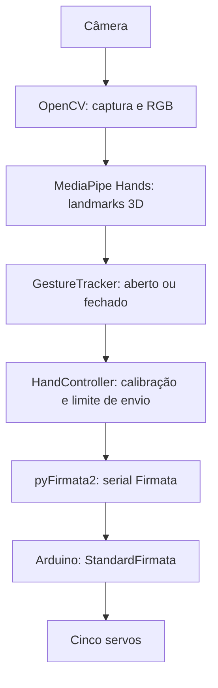

# 🤖 Mão Robótica Controlada por Visão Computacional

Controle de cinco dedos com Python, MediaPipe Hands e Arduino via Firmata.
Uma câmera fornece a imagem da mão; cada dedo é classificado como aberto ou
fechado e associado a uma posição de servo configurável.

## 📌 Sobre o projeto

Projeto de Ronilson Lima Souza que integra visão computacional e robótica.
O processamento ocorre no computador. O Arduino executa os comandos de servo
recebidos por comunicação serial, usando o sketch StandardFirmata.

## ✨ Funcionalidades

- Rastreamento de uma mão com MediaPipe Hands e visualização com OpenCV.
- Classificação independente dos cinco dedos, com histerese e confirmação temporal.
- Calibração de pinos e posições em JSON, compartilhada pelo controle e pelo teste.
- Porta serial e índice da câmera configuráveis por linha de comando.
- Simulação de comandos com câmera e demonstração com landmarks sintéticos.
- Política configurável para perda de detecção: manter posição ou abrir.

## 🧠 Como funciona

O OpenCV captura quadros, espelha a imagem e converte BGR para RGB. O MediaPipe
é configurado para uma mão, com confiança mínima de detecção e rastreamento de
0,6. A classificação usa os 21 landmarks 3D de `multi_hand_world_landmarks`;
os landmarks da imagem servem para desenhar a mão na janela.

`gestos.py` calcula dois ângulos por dedo usando os grupos abaixo. O ponto 0
(punho) integra os 21 pontos recebidos, mas não participa desses cálculos.

| Dedo | Landmarks |
|---|---|
| Polegar | 1, 2, 3, 4 |
| Indicador | 5, 6, 7, 8 |
| Médio | 9, 10, 11, 12 |
| Anelar | 13, 14, 15, 16 |
| Mínimo | 17, 18, 19, 20 |

Para médio, anelar e mínimo, ambos os ângulos devem atingir 155° para abrir;
um ângulo de até 135° fecha. No indicador, os limites de abertura são 155° e
135°, e os de fechamento são 135° e 110°, respectivamente. O polegar usa
os limites gerais e a distância entre os pontos 4 e 5 dividida pela distância
entre 5 e 17: pelo menos 0,6 para abrir, ou até 0,45 para fechar.

Uma mudança requer três quadros consecutivos. Na faixa intermediária, mantém-se
o estado anterior. O controle é binário por dedo; não reproduz continuamente
o ângulo da mão humana. Oclusões e erros de estimação podem afetar a classificação.

## 🏗️ Arquitetura



O sketch inicia Firmata a **57.600 baud**. Python usa `servo_config` na
inicialização e `board.digital[pin].write(angle)` para mudanças de posição.
O firmware trata `SERVO_CONFIG` e mensagens analógicas Firmata, encaminhando
os valores para `Servo.write`. Não há protocolo textual próprio com nomes de dedos.
O controlador limita os ciclos de atualização a 20 por segundo e só escreve
posições alteradas. Isso é um limite do código, não uma medição de desempenho.

## 🛠️ Tecnologias

Python, MediaPipe Hands, OpenCV (`opencv-contrib-python`), NumPy, pyFirmata2,
pySerial e Arduino/C++. O sketch inclui as bibliotecas Firmata, Servo e Wire.
JAX e jaxlib são dependências transitivas restringidas em `constraints.txt`.

## 🔌 Hardware

O código prevê uma câmera acessível pelo OpenCV, uma placa Arduino com Firmata
e cinco servos, um por dedo. O cliente `pyfirmata2.Arduino` e a validação de
pinos usam o mapeamento do Uno; o modelo físico da placa precisa ser confirmado.

A documentação anterior menciona uma Logitech C920 e um adaptador CH340;
isso não estabelece uma lista completa de materiais nem torna esses modelos
obrigatórios. Modelos dos servos, alimentação, conexões elétricas e estrutura
mecânica precisam ser confirmados pelo proprietário. Não há esquema elétrico
ou arquivos de fabricação no repositório.

| Dedo | Pino digital | Aberto | Fechado |
|---|---:|---:|---:|
| Polegar | 10 | 0° | 150° |
| Indicador | 9 | 130° | 0° |
| Médio | 8 | 130° | 0° |
| Anelar | 7 | 0° | 130° |
| Mínimo | 6 | 130° | 0° |

Esses são os valores de `calibracao.json`, não uma calibração mecânica
certificada. Confirme alimentação e limites mecânicos antes de acionar os
servos: a conexão real envia imediatamente as posições de abertura.

## 📁 Estrutura do projeto

```text
mao-robotica/
├── StandardFirmata/
│   ├── StandardFirmata.ino
│   └── LICENSE.txt
├── mao-robotica-mediapipe-main/
│   ├── main.py
│   ├── gestos.py
│   ├── servo_braco3d.py
│   ├── testar-dedos.py
│   ├── calibracao.json
│   └── requirements.txt
├── tests/test_project.py
├── Comando para execução.txt
├── constraints.txt
├── requirements.txt
├── requirements-lock.txt
├── LICENSE
├── THIRD_PARTY_NOTICES.md
├── .gitattributes
├── .gitignore
└── README.md
```

Os caminhos originais foram preservados para manter os comandos existentes.
O requirements da subpasta encaminha para o arquivo da raiz.

## ⚙️ Instalação

Use **Python 3.12**, ambiente alvo documentado pelo projeto original.
As versões fixadas preservam a API `mediapipe.solutions.hands`. A disponibilidade
de pacotes depende do sistema e arquitetura; veja os [arquivos da versão do
MediaPipe](https://pypi.org/project/mediapipe/0.10.21/#files).

Linux, na raiz do projeto:

```bash
git clone https://github.com/Ronilsondev/mao-robotica.git
cd mao-robotica
python3.12 -m venv .venv
.venv/bin/python -m pip install -r requirements.txt
.venv/bin/python -m pip check
```

No Windows, crie o ambiente com `py -3.12 -m venv .venv` e substitua
`.venv/bin/python` por `.venv\Scripts\python.exe` nos comandos.
Não instale outra distribuição OpenCV no mesmo ambiente: ambas forneceriam `cv2`.

`requirements.txt` lista os imports externos usados pela aplicação;
`constraints.txt` preserva os pins transitivos de JAX do projeto original.
`requirements-lock.txt` é o registro anterior de versões, mantido para referência;
não foi regenerado nem instalado integralmente nesta preparação.
A instalação por `requirements.txt` e `constraints.txt` foi verificada em Linux
x86_64 com Python 3.12.14. `pip check` não encontrou dependências quebradas.

## 🔧 Arduino

1. Abra `StandardFirmata/StandardFirmata.ino` na Arduino IDE.
2. Disponibilize Firmata e Servo pelo gerenciador de bibliotecas; Wire pertence
   ao core da placa. As versões usadas na montagem original não estão registradas.
3. Selecione a placa real e a porta correspondente, verifique e carregue o sketch.
4. Feche o monitor serial antes de iniciar Python.

A compatibilidade com a placa e as versões das bibliotecas deve ser validada
na montagem. Este trabalho não compilou nem gravou o firmware.
O sketch de terceiros conserva seus avisos de autoria e LGPL.

## 🚀 Execução

Todos os comandos abaixo partem da raiz, após instalar as dependências.

```bash
# Ajuda e portas disponíveis
.venv/bin/python mao-robotica-mediapipe-main/main.py --help
.venv/bin/python mao-robotica-mediapipe-main/main.py --list-ports

# Câmera e Arduino: ajuste o índice e a porta
.venv/bin/python mao-robotica-mediapipe-main/main.py --camera 0 --port /dev/ttyUSB0

# Câmera real, comandos apenas no terminal
.venv/bin/python mao-robotica-mediapipe-main/main.py --camera 0 --simulate

# Demonstração sintética limitada, sem câmera, Arduino ou janela
.venv/bin/python mao-robotica-mediapipe-main/main.py --demo --headless --frames 100
```

`/dev/ttyUSB0` é um exemplo; no Windows, informe a porta real, como `COM3`.
Índices de câmera e portas variam entre computadores. A simulação não conecta
à placa. A demonstração artificial não testa a inferência do MediaPipe.

## 🎮 Funcionamento e calibração

Apresente uma mão à câmera. A janela mostra os pontos e os ângulos comandados,
sem medir a posição física dos servos. Pressione **Q**, **Esc**, feche a janela
ou use **Ctrl+C** para encerrar. O código libera câmera, detector e conexão da
placa por gerenciadores de contexto.

Sem mão detectada, o padrão é manter a última posição. Para solicitar abertura
após dois segundos de ausência:

```bash
.venv/bin/python mao-robotica-mediapipe-main/main.py --camera 0 --port /dev/ttyUSB0 --lost-action open --lost-timeout 2
```

Uma falha de captura encerra a aplicação. Não há watchdog específico para o
controle da mão no firmware; perda de conexão ou encerramento forçado não
garantem parada ou retorno a uma posição segura.

Edite `mao-robotica-mediapipe-main/calibracao.json` para ajustar os cinco dedos.
Cada entrada exige `pin`, `open` e `closed`: pinos distintos entre 2 e 13,
ângulos inteiros entre 0 e 180. `--config caminho.json` seleciona outro perfil;
o caminho padrão independe do diretório de execução.

```bash
# Sequência no terminal, sem servos
.venv/bin/python mao-robotica-mediapipe-main/testar-dedos.py --simulate

# Aciona hardware: abre todos, fecha e abre cada dedo, e encerra
.venv/bin/python mao-robotica-mediapipe-main/testar-dedos.py --port /dev/ttyUSB0
```

Encerre o rastreamento antes de executar o teste na mesma porta.

## 🧪 Verificações

```bash
.venv/bin/python -m compileall -q mao-robotica-mediapipe-main tests
.venv/bin/python -m unittest discover -s tests -v
# Alternativa usada na validação final; pytest é ferramenta de desenvolvimento
.venv/bin/python -m pip install pytest
.venv/bin/python -m pytest -q
.venv/bin/python -m pip check
```

Os testes existentes usam objetos simulados para câmera, detector e placa;
exigem as dependências instaladas, mas não acionam hardware. Cobrem geometria,
estabilização, calibração, envio de comandos e liberação de recursos.
Em Linux x86_64 com Python 3.12.14, os testes de software tiveram resultado
**15 passed, 0 failed, 0 errors**. A verificação de sintaxe e a demonstração
sem janela de 100 quadros também passaram. Os testes
simulam câmera e placa; a montagem física e a inferência com mão real não foram
validadas nessa execução. O Protobuf 4.25.9 emitiu avisos de depreciação sobre
uma API de extensão incompatível com Python 3.14; mantenha Python 3.12 para
este ambiente.

## 📷 Demonstração

Não há fotos ou vídeos versionados. O modo `--demo` é uma demonstração
sintética do fluxo lógico, sem comprovar funcionamento físico. Mídia real
poderá ser adicionada após confirmar autoria e autorização das pessoas retratadas.

## 🗺️ Melhorias futuras

Ideias ainda não implementadas ou documentadas:

- Registrar lista de materiais, alimentação e esquema elétrico da montagem.
- Validar e registrar versões das bibliotecas Arduino usadas na montagem.
- Publicar demonstração real com procedência e autorização verificadas.
- Avaliar um watchdog no firmware para perda da conexão com o computador.

## 🤝 Contribuições

Abra uma issue descrevendo o problema, sistema, versão do Python e passos para
reprodução, sem dados privados. Para alterações, envie um pull request pequeno,
explique o efeito sobre o controle e execute as verificações acima. Mudanças
que acionem servos também precisam de validação física documentada.

## 📄 Licença

O código autoral deste projeto é distribuído sob a [licença MIT](LICENSE).
Copyright (c) 2026 Ronilson Lima Souza.

**StandardFirmata é software de terceiros do projeto
[Firmata](https://github.com/firmata/arduino)** e permanece sob
**LGPL-2.1-or-later**. A licença MIT do projeto não substitui a licença do
firmware nem as licenças de outras dependências externas. O texto oficial
completo está em [StandardFirmata/LICENSE.txt](StandardFirmata/LICENSE.txt);
os copyrights originais do sketch foram preservados.

A cópia local corresponde ao código do exemplo da versão **2.5.9**, com
apenas diferenças de formatação de comentários e finais de linha. Isso não
comprova de onde foi baixada originalmente. Veja as referências oficiais em
[THIRD_PARTY_NOTICES.md](THIRD_PARTY_NOTICES.md).

## 👨‍💻 Autor

**Ronilson Lima Souza** — [Ronilsondev](https://github.com/Ronilsondev)
